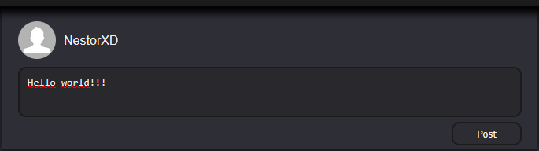

# Zlaloon

This social network is a project created to put into practice knowledge about databases, information security, and web development in general.

## Discover Content
Explore posts and users recommended to you based on your activity and interests.

## Create Posts
Once you register and have an account, you can create posts that others can like, dislike, or even share.

## Follow Profiles
If you want to stay updated on someone's posts, you can start following their profile.

## Search Profiles
If you need to find a profile, you can try searching for it by name — the search engine will return the closest possible match.

## And More...
The app is still under development, so new features are on the way and yet to be revealed...

There will be more updates these months...
